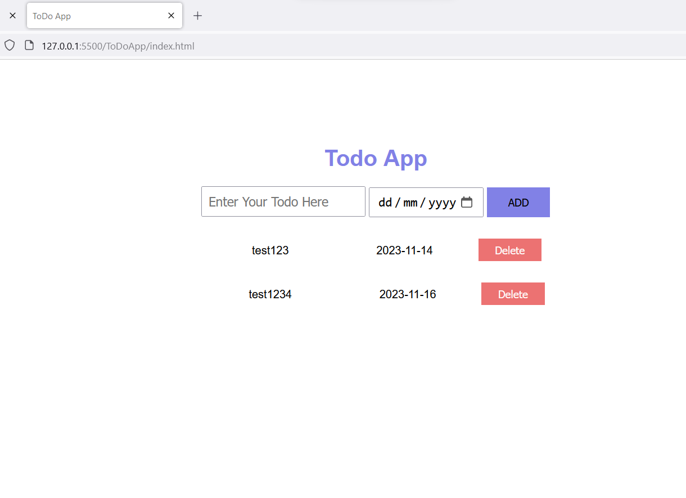

# Todo-Application
<h3>Todo Application helps in maintaining day to day performing activities,</h3>
<h3>Todo Application is built using core frontend languages [i.e., HTML, CSS, Javascript]</h3>
<h3>Main purpose of building application is for Learning purpose</h3>

